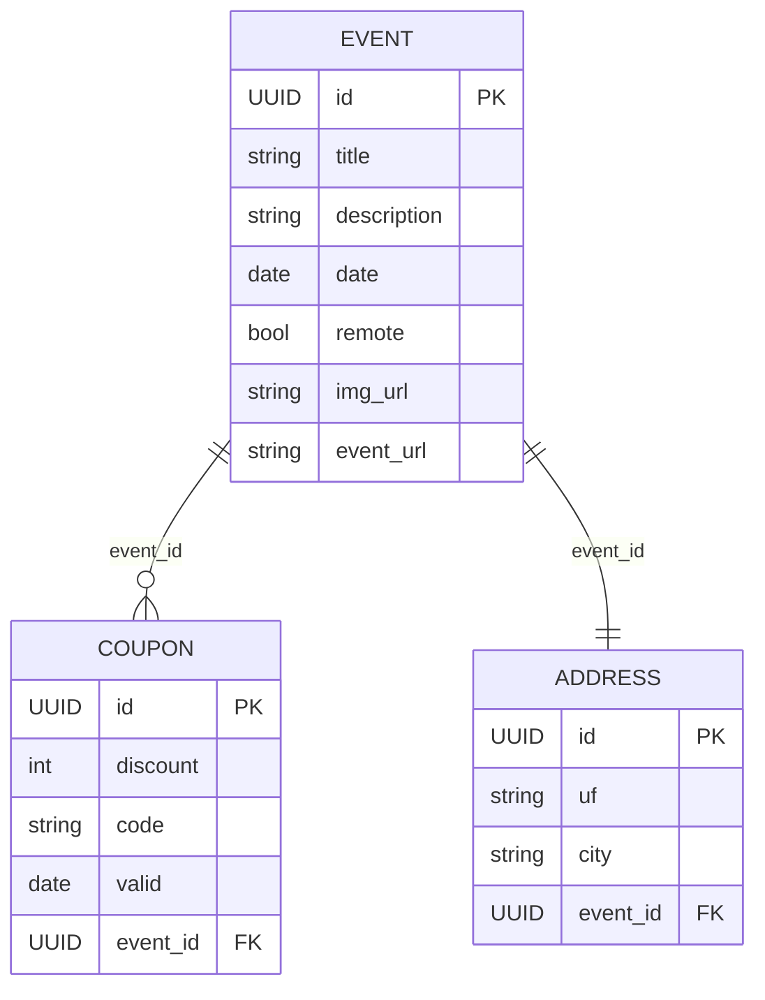
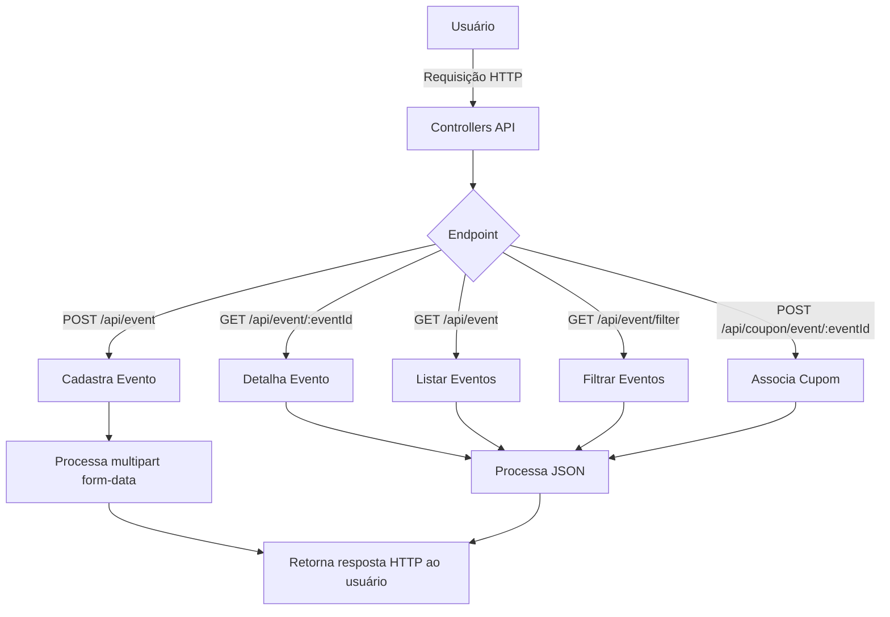

# Eventos Tech <💻/>

#### Descrição do Projeto

Eventos Tech é uma aplicação backend desenvolvida em Java com Spring Boot, que fornece uma API REST para cadastro, consulta e gerenciamento de eventos. O projeto inclui upload opcional de imagens para armazenamento na Amazon S3 e suporte à listagem de eventos com paginação.

## 🎯 Objetivo

#### Desenvolver o backend de uma aplicação para:

* Gerenciar eventos de tecnologia (remotos ou presenciais)
* Permitir cadastro, consulta, listagem paginada e filtragem de eventos
* Associar cupons de desconto aos eventos
* Exibir detalhes completos de cada evento
---

#### 📊 Diagrama Entidade-Relacionamento (ERD)


* **EVENT**: armazena informações sobre os eventos de tecnologia.
* **COUPON**: cupons de desconto associados a eventos específicos (um evento pode ter vários cupons, mas cada cupom pertence a apenas um evento)
* **ADDRESS**: endereço físico de um evento presencial (um evento possui um único endereço).
---


A aplicação é hospedada em uma VPC na AWS, dividida em:

**Subnet pública**:
Contém uma instância EC2 que executa o backend Java Spring Boot e recebe requisições via Internet Gateway.

**Subnet privada**:
Contém o banco de dados Amazon RDS PostgreSQL, acessado apenas pela EC2.

**Amazon S3**:
Responsável pelo armazenamento das imagens dos eventos, enviadas diretamente pelo servidor EC2.

> Fluxo: Usuários acessam via internet → EC2 processa requisições → acessa RDS para dados e S3 para imagens → retorna resposta.

#### ☁️ Infraestrutura AWS

Para o ambiente de produção, a aplicação foi estruturada na AWS com os seguintes recursos:

* VPC (Virtual Private Cloud)
* Internet Gateway (IGW)
* Subnets públicas e privadas
* Instância EC2 para hospedagem do servidor Java
* Amazon S3 para armazenamento de imagens de eventos
* Amazon RDS (PostgresSQL) para persistência dos dados
  
> **Obs: Em ambiente de desenvolvimento, utiliza banco H2 em memória.**

---
#### 🚀 Tecnologias Utilizadas

* Java 21
* Spring Boot 3.x
* Spring Data JPA
* PostgreSQL
* H2 localmente
* AWS (Gateway, EC2, S3, RDS)
* Maven
* Git

#### 🧪 Testes

* Testes unitários com JUnit 5 e Mockito
* Testes de integração com Spring Boot Test
  
---

#### 📡 Endpoints da API


#### 📁 Event

| Método   | Endpoint               | Descrição                                                           |
| :------- | :--------------------- | :------------------------------------------------------------------ |
| **POST** | `/api/event`           | Cadastra um novo evento (**requisição via multipart/form-data**)                                         |
| **GET**  | `/api/event/{eventId}` | Busca os detalhes completos de um evento pelo seu ID                |
| **GET**  | `/api/event`           | Retorna os próximos eventos cadastrados, com paginação              |
| **GET**  | `/api/event/filter`    | Lista eventos filtrados por título, cidade, UF e intervalo de datas |

#### 🎟️ Coupon

| Método   | Endpoint                      | Descrição                                               |
| :------- | :---------------------------- | :------------------------------------------------------ |
| **POST** | `/api/coupon/event/{eventId}` | Associa um novo cupom de desconto a um evento existente |

---
#### 📝 Estrutura da Requisição Multipart para Criação de Evento

Para criar um evento via `POST /api/event`, utilize o tipo de conteúdo `multipart/form-data` com os seguintes campos:

* `title` (string): título do evento
* `description` (string, opcional): descrição detalhada
* `eventUrl` (string): URL oficial do evento
* `date` (long): timestamp em milissegundos (ex.: `1751234439000`)
* `remote` (boolean): indica se o evento é remoto (`true` ou `false`)
* `city` (string): cidade do evento
* `uf` (string): unidade federativa (ex.: `SP`)
* `image` (file, opcional): arquivo de imagem (`.png`, `.jpg`, etc.)

Exemplo no Postman:

```
POST http://localhost:8080/api/event
Content-Type: multipart/form-data

-- Form fields --
title: Frontin Sampa
city: São Paulo
uf: SP
remote: false
date: 1751234439000
eventUrl: https://frontinsampa.com
description: Teste local H2
image: [arquivo frontin.png]
```

#### 📝 Estrutura da Requisição JSON para Associação de Cupom

Para associar um cupom a um evento via **POST** `/api/coupon/event/{eventId}`, envie um **JSON** com os seguintes campos:

```
{
  "code": "BEM-VINDO30",
  "discount": 20,
  "valid": 1518030431
}
```


**code (string)**: código do cupom de desconto.

**discount (number)**: valor ou percentual de desconto.

**valid (number)**: timestamp de validade.

---

### 📌 Importante

A infraestrutura AWS deste projeto possui recursos com IP público configurado para uso restrito e protegido. Os endpoints públicos não são disponibilizados neste repositório.

Para demonstração ou testes no ambiente cloud (AWS), entre em contato:

* 📧 [deizianerodriguesdev@hotmail.com](mailto:deizianerodriguesdev@hotmail.com)
* 💼 [LinkedIn](https://www.linkedin.com/in/deizianer/)

---

#### ▶️ Como executar a aplicação localmente

A aplicação pode ser executada localmente com o profile `test` sem consumir recursos cloud.

**Pré-requisitos**

* *Java 21*
* *Maven*

### Executando com profile test (H2)

#### via terminal:

`mvn spring-boot:run -Dspring-boot.run.profiles=test`

#### Ou via IDE:

> Clique com o botão direito no projeto → Run As → Spring Boot App

A aplicação estará disponível em: http://localhost:8080

---
### 👩‍💻 Feito por

**Deiziane Rodrigues**

💼 Vamos nos conectar:  [LinkedIn](https://www.linkedin.com/in/deizianer/)

📧 [deizianerodriguesdev@hotmail.com](deizianerodriguesdev@hotmail.com)
